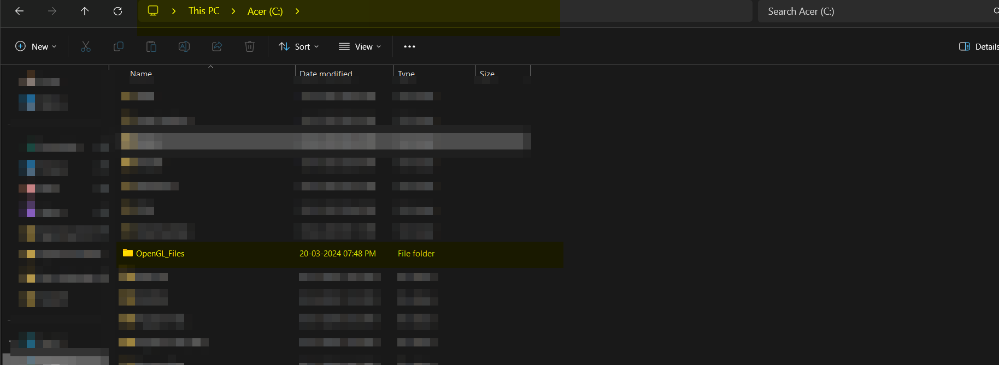
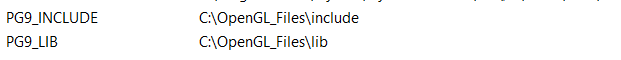

## Requirements

The following setup is for people who want to run the source code of book Opengl Programming guide on windows using visual studio 2022

## Steps

there are not many(trust me)

1. Clone the repo
2. Cut the folder **"OpenGL_Files"** and past it in your C drive

   > Caution : The folder must be pasted in the root (not in any folder)
   > 

   It contains 3 files

   1.include  
    2.lib  
    3. media (this contains media to be used by code examples of book)

3. Configure the user path variables(environment variables > user variables[not system variables])
   

## Run

Thats it
now you can run Visual Studio Solution (MyProject\HelloPG) by the name of HelloPG.sln

By default there is a 10-fur.cpp file through which you can test whether this setup is working for you or not

If you want to run some other code just change it or copy paste from [Official git repo of book](https://github.com/openglredbook/examples/tree/master/src)

> Make sure if the code containes media files location like `/media/ninja.vbm` change it with `C:/OpenGL_Files/media/ninja.vbm` Since this is the location of our media folder
